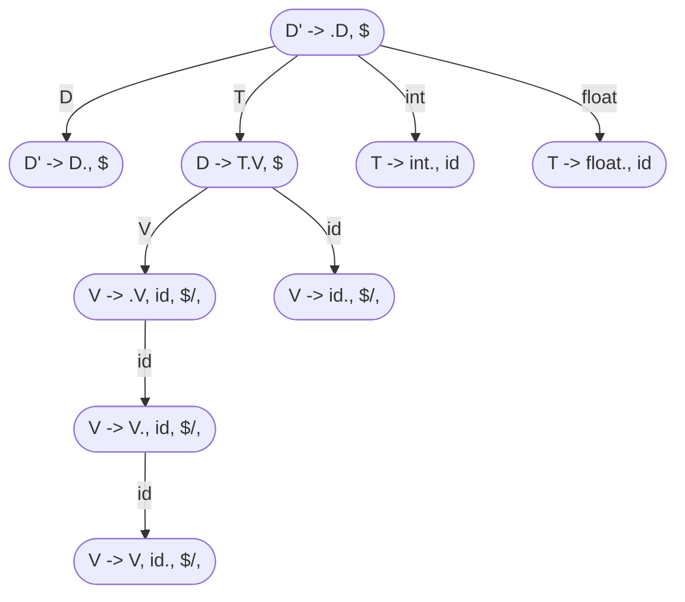

(d)

|  | Parsing stack | Input | Action |
| --- | --- | --- | --- |
| 1 | $0 | int x,y,z$ | shift 3 |
| 2 | $0 int 3 | x,y,z$ | reduce 2 |
| 3 | $0 T2 | x,y,z$ | shift 6 |
| 4 | $0 T2 id 6 | ,y,z$ | reduce 5 |
| 5 | $0 T2 V5 | ,y,z$ | shift 7 |
| 6 | $0 T2 V5,7 | y,z$ | shift 8 |
| 7 | $0 T2 V5,7 id 8 | ,z$ | reduce 4 |
| 8 | $0 T2 V5 | ,z$ | shift 7 |
| 9 | $0 T2 V5,7 | z$ | shift 8 |
| 10 | $0 T2 V5,7 id 8 | $ | reduce 4 |
| 11 | $0 T2 V5 | $ | reduce 1 |
| 12 | $0 D1 | $ | accept |

(e)

(f) The LALR(1) parsing table is the same as the SLR(1) parsing table shown in (c).

### Exercise 5.10

We use similar language to that on page 210, with appropriate modifications:

**The SLR(1) parsing algorithm.** Let \( s \) be the current state whose number is at the top of the parsing stack. Then actions are defined as follows:

(1) If state \( s \) contains any item of the form \( A \rightarrow \alpha . X \beta \), where \( X \) is a terminal, and \( X \) is the next token in the input string, then the action is to remove the current input token and push onto the stack the number of the state containing the item \( A \rightarrow \alpha X . \beta \).